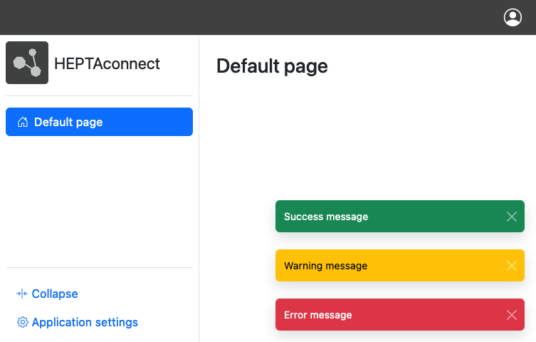

# Web Frontend Package
#### This is part of HEPTACOM solutions for medium and large enterprises.

## Description

This is a HEPTAconnect package to build web frontends for portals and integrations.
Read more in the [documentation](https://heptaconnect.io/).

### Features

#### Twig

Build web page using [Twig templates](https://twig.symfony.com/doc/3.x/).
Twig provides a basic infrastructure for replacements and extensibility by portals, extensions and other packages.

#### Bootstrap

A basic page structure is provided with a topbar, sidebar, main content area and notifications.
The page is built using [Bootstrap](https://getbootstrap.com/docs/5.3/).
It supports automatic and manual dark mode.

#### Themes

Packages can provide custom assets, templates and influence each other to allow full customization to build your own web page.

#### Access protection

All paths handled using the `UiHandlerContract` are protected by default.
You can make exceptions and make publicly available pages.
Logins can be achieved using different provided functionalities: one time login, [htpasswd](https://httpd.apache.org/docs/current/programs/htpasswd.html)-alike user storage, custom authentication backends.

#### More

- Cookie based browser sessions
- Notification
- Error handling
- Debugging

#### Configurable Feature Separation

A lot of features can be configured and disabled to ensure you can build your application instead of adapting yourself to the application.
Read more about the configuration in our [documentation](./docs/index.md).

## System requirements

* PHP 8.0 or above

## Changelog

See the attached [CHANGELOG.md](./CHANGELOG.md) file for a complete version history and release notes.

## Additional development requirements

* Make
* Any debugging/coverage php extension like xdebug or pcov

## Contributing

Thank you for considering contributing to this package! Be sure to sign the [CLA](./CLA.md) after creating the pull request. 

### Steps to contribute

1. Fork the repository
2. `git clone yourname/heptaconnect-package-web-frontend`
3. Make your changes to master branch
4. Create your Pull-Request

### Check your changes

1. Check and fix code style `make cs-fix && make cs`
2. Check tests `make test`
3. Check whether test code coverage is same or higher `make coverage`
4. Check whether tests can find future obscurities `make infection`

## License

Copyright 2020 HEPTACOM GmbH

Dual licensed under the [GNU Affero General Public License v3.0](./LICENSE.md) (the "License") and proprietary license; you may not use this project except in compliance with the License.
You may obtain a copy of the AGPL License at [https://spdx.org/licenses/AGPL-3.0-or-later.html](https://spdx.org/licenses/AGPL-3.0-or-later.html).
Contact us on [our website](https://www.heptacom.de) for further information about proprietary usage.
